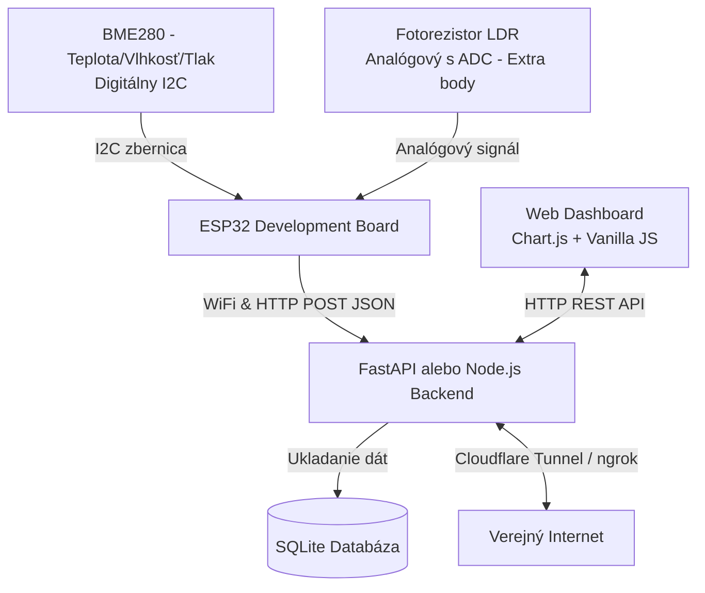

# Projektový Plán: Meranie Fyzikálnej Veličiny s Vizualizáciou (MISA)

Tento dokument slúži ako komplexný sprievodca, plán a zoznam požiadaviek pre úspešné zvládnutie semestrálneho projektu podľa zadania v [PLAN-markdown.md](file:///c:/Projects/MISA/PLAN-markdown.md).

---

## 1. Odporúčaná Architektúra (Náš Návrh)

Pre dosiahnutie najlepšieho hodnotenia (s primeranou náročnosťou) odporúčame nasledovný moderný a robustný stack:



### Prečo tento stack?
* **ESP32:** Má integrovanú WiFi, obrovskú komunitnú podporu a je veľmi lacný (cca 4-6 €). Má dostatok pamäte v porovnaní s ESP8266.
* **BME280 (Digitálny - Kategória A):** Meria 3 veličiny naraz (teplota, vlhkosť, tlak). Je stabilný a presný.
* **LDR Fotorezistor (Analógový - Kategória B):** Pridaním tohto snímača splníte podmienku pre **rozšírenie projektu** (analógové meranie s ADC kalibráciou), čo vám prinesie extra body pri obhajobe.
* **FastAPI (Python) alebo Node.js (Express):** Veľmi rýchle na implementáciu. Umožní napísať vlastný backend za pár hodín.
* **SQLite:** Lokálna súborová databáza, nevyžaduje inštaláciu žiadneho ťažkého databázového servera (ako MySQL/PostgreSQL), no plne spĺňa podmienku R3.
* **Cloudflare Tunnel (alebo ngrok):** Bezpečný spôsob, ako vystaviť lokálne spustený server do internetu bez potreby verejnej IP adresy.

---

## 2. Čo všetko budete potrebovať (Hardvér & Softvér)

### Hardvérové komponenty (Nákupný zoznam):
1. **ESP32 NodeMCU Development Board** (napr. ESP32-WROOM-32D) – 1x
2. **BME280 Senzor** (verzia pre I2C s 4 pinmi: VCC, GND, SCL, SDA) – 1x
3. **Fotorezistor (LDR)** – 1x
4. **Rezistor 10kΩ** (pre vytvorenie napäťového deliča k fotorezistoru) – 1x
5. **Nepájivé pole (Breadboard)** – 1x
6. **Prepojovacie kábliky (Dupont wires)** – M-M (Male-Male) a F-M (Female-Male)
7. **Micro-USB kábel** (s podporou prenosu dát) – 1x

### Softvérové nástroje:
1. **VS Code** + rozšírenie **PlatformIO** (alebo **Arduino IDE** v2.x) – pre vývoj firmvéru.
2. **Python** (pre FastAPI) alebo **Node.js** (pre Express) – pre backend.
3. **Git** – pre správu verzií a GitHub repozitár.
4. **ngrok** alebo **Cloudflare Tunnel (cloudflared)** – pre sprístupnenie na internete.

---

## 3. Krok-za-krokom Plán Implementácie

### Fáza 1: Hardvér a Čítanie Senzorov (Lokálny Test)
* [ ] **Zapojenie hardvéru:**
  * Pripojiť BME280 k ESP32 cez I2C (SDA -> GPIO 21, SCL -> GPIO 22, VCC -> 3.3V, GND -> GND).
  * Pripojiť LDR fotorezistor ako napäťový delič (3.3V -> LDR -> GPIO 34 (ADC) -> 10kΩ rezistor -> GND).
* [ ] **Základný firmvér:**
  * Vytvoriť projekt v PlatformIO/Arduino IDE.
  * Nainštalovať knižnice `Adafruit BME280 Library` a `Adafruit Unified Sensor`.
  * Napísať kód, ktorý v `setup()` inicializuje I2C a v `loop()` každých 10 sekúnd prečíta teplotu, vlhkosť, tlak a analógovú hodnotu z LDR.
  * Otestovať čítanie cez Serial Monitor.

### Fáza 2: Bezdrôtový prenos (WiFi + HTTP/JSON)
* [ ] **Pripojenie na WiFi:**
  * Pridať do firmvéru knižnicu `WiFi.h`.
  * Implementovať automatické pripojenie k domácej WiFi / hotspotu z telefónu.
  * Pridať logiku pre automatické znovupripojenie v prípade výpadku signálu.
* [ ] **Odosielanie dát:**
  * Pridať knižnicu `HTTPClient.h` a `ArduinoJson.h`.
  * Vytvoriť JSON objekt s nameranými hodnotami, jednotkami a identifikátorom senzora.
  * Odosielať dáta pomocou HTTP POST na (zatiaľ) lokálnu IP adresu vášho počítača (napr. `http://192.168.1.50:8000/api/measurements`).

### Fáza 3: Backend a Databáza (Ukladanie dát)
* [ ] **Vytvorenie API:**
  * Inicializovať projekt (napr. Python FastAPI).
  * Vytvoriť endpoint `POST /api/measurements`, ktorý prijme JSON dáta od ESP32.
  * Vytvoriť endpoint `GET /api/measurements/latest` pre získanie aktuálnej hodnoty.
  * Vytvoriť endpoint `GET /api/measurements/history` pre získanie histórie (napr. za posledných 24 hodín).
* [ ] **Databáza:**
  * Použiť SQLite na ukladanie prichádzajúcich správ.
  * Každý záznam bude obsahovať: `id`, `sensor_name`, `value_type` (teplota/vlhkosť/svetlo...), `value`, `unit`, `timestamp` (časová pečiatka vygenerovaná serverom, čo zaručuje presnosť).

### Fáza 4: Webová Vizualizácia (Frontend)
* [ ] **Návrh Dashboardu:**
  * Vytvoriť jednoduchú a estetickú HTML stránku (umiestnenú na backend serveri alebo samostatne).
  * Použiť Google Fonts (napr. *Inter* alebo *Outfit*) pre moderný vzhľad.
* [ ] **Implementácia komponentov:**
  * Zobraziť aktuálnu hodnotu (veľký widget s peknou farbou a ikonou).
  * Pridať indikátor "Naposledy aktualizované pred X sekundami".
  * Integrovať knižnicu **Chart.js** pre interaktívny graf historických dát (posledných 24h).
  * Pomocou `fetch()` v JavaScripte pravidelne (napr. každých 10 sekúnd) ťahať najnovšie dáta z API a aktualizovať graf/hodnoty bez nutnosti obnovovať celú stránku (AJAX).

### Fáza 5: Verejná Dostupnosť a Nasadenie (R5)
* [ ] **Nastavenie Tunela:**
  * Nainštalovať `ngrok` alebo `cloudflared` na počítač, kde beží backend.
  * Spustiť tunel nasmerovaný na lokálny port backendu (napr. port 8000).
  * Získať verejnú HTTPS adresu (napr. `https://misa-projekt.trycloudflare.com` alebo `https://random-subdomain.ngrok-free.app`).
* [ ] **Aktualizácia ESP32:**
  * Zmeniť cieľovú adresu v ESP32 kóde z lokálnej IP adresy na novú verejnú HTTPS adresu tunela.
  * Otestovať, že ESP32 úspešne odosiela dáta z inej siete (napr. keď je ESP32 pripojené na hotspot z mobilu a server beží na domácej sieti).

### Fáza 6: Dokumentácia a Verziovanie (Git & GitHub)
* [ ] **Git Repozitár:**
  * Vytvoriť repozitár v priečinku projektu.
  * Správne nastaviť `.gitignore` (necommitovať heslá k WiFi, build priečinky PlatformIO, lokálne databázy `.db` ani virtuálne prostredia Pythonu).
  * Urobiť priebežné commity pre jednotlivé fázy (žiadne nahranie celého projektu jedným commitom!).
* [ ] **Dokumentácia:**
  * Vytvoriť diagram architektúry (napr. pomocou draw.io alebo Mermaid priamo v Markdown).
  * Nakresliť schému zapojenia (Fritzing alebo prehľadný náčrt).
  * Vyplniť `README.md` podľa bodu 8.2 v zadaní.

---

## 4. Príklad formátu správ (JSON)

Server bude od ESP32 očakávať správu v takomto formáte:

```json
{
  "sensor": "ESP32-Station-1",
  "temperature": 23.4,
  "humidity": 45.2,
  "pressure": 1013.25,
  "light_intensity": 650
}
```

Server následne pri uložení do databázy automaticky priradí časovú pečiatku (`timestamp`), čím sa vyhneme potrebe synchronizovať čas priamo na ESP32 (čo by vyžadovalo NTP klienta a komplikovalo firmvér).

---

## 5. Tipy na Obhajobu (Na čo si dať pozor)

1. **Robustnosť pri výpadku WiFi:** Skúšajúci počas obhajoby môže vypnúť váš WiFi router alebo hotspot. ESP32 sa **musí** po opätovnom zapnutí siete automaticky znova pripojiť a pokračovať v meraní bez toho, aby ste ho museli reštartovať tlačidlom (tzv. watchdog / reconnection loop).
2. **Kategória B (Analógový senzor):** Pri fotorezistore sa pripravte na otázku: *„Ako ste prepočítali surovú hodnotu z ADC (0-4095) na reálnu veličinu?“* (Budeme musieť implementovať jednoduchý prepočet v kóde, napr. na percentá osvetlenia alebo luxy).
3. **Odôvodnenie technológií:** V README.md a pri reči musíte vedieť jasne povedať, prečo ste zvolili daný komunikačný protokol (napr. „Zvolili sme HTTP POST, pretože pre náš scenár jednosmerného posielania v pravidelných intervaloch je to najjednoduchšie na implementáciu a zabezpečenie pomocou HTTPS bez nutnosti prevádzkovať MQTT broker“).

---

## 6. Presný plán reuse z Project11

Toto je odporúčaný plán, ako z Project11 zobrať maximum hotových komponentov a pritom ich prispôsobiť zadaniu MISA bez zbytočného prepisovania celej aplikácie.

### 6.1 Čo z Project11 použiť priamo

1. **Backend kostru z FastAPI**
  - ponechať štruktúru projektu s `app.py`, `models.py`, `templates/` a `static/`;
  - ponechať mountovanie `static` a renderovanie HTML cez Jinja2;
  - ponechať SQLite a SQLAlchemy ako perzistentnú vrstvu.

2. **Frontend dashboard ako základ**
  - použiť existujúci layout z `templates/index.html` ako štartovaciu kostru;
  - ponechať Chart.js a štýlovanie cez `static/css/style.css`;
  - ponechať logiku pre tabuľku histórie, stavové badge a vizuálnu spätnú väzbu.

3. **Dokumentačnú štruktúru**
  - použiť `DOCUMENTATION.md` ako vzor pre finálny README a technickú dokumentáciu;
  - zachovať rozdelenie na architektúru, vývojársku príručku a používateľskú príručku.

### 6.2 Čo upraviť, ale netreba písať od nuly

1. **Dátový model**
  - v `models.py` nahradiť `temp`, `hum`, `target_temp`, `actuator`, `state` modelom vhodným pre MISA;
  - odporúčaná tabuľka: `id`, `sensor_name`, `value_type`, `value`, `unit`, `timestamp`;
  - ak chceš archivovať viac veličín naraz, ukladať každý parameter ako samostatný záznam.

2. **Serverové API**
  - zmeniť WebSocket centric flow na REST endpointy;
  - doplniť `POST /api/measurements` pre ESP32;
  - doplniť `GET /api/measurements/latest` a `GET /api/measurements/history` pre frontend;
  - ponechať SQLite zápis a JSON odpovede.

3. **Frontend komunikáciu**
  - nahradiť WebSockety vo `static/js/main.js` pravidelným `fetch()` pollingom;
  - zachovať Chart.js, ale plniť ho dátami z API;
  - upraviť UI na teplotu, vlhkosť, tlak a svetlo namiesto termostatickej regulácie.

4. **Firmware pre ESP32**
  - prepísať Arduino sketch na ESP32;
  - pridať `WiFi.h`, `HTTPClient.h`, `ArduinoJson.h`;
  - odosielať JSON na backend cez HTTP POST;
  - pre LDR pridať ADC čítanie a jednoduchý prepočet na percentá alebo približné luxy.

### 6.3 Čo nepoužiť priamo

1. **WebSocket riadenie zo Project11**
  - pre MISA je vhodnejší HTTP REST než push komunikácia cez WebSocket;
  - WebSocket ponechať len ak chceš doplnkovú funkcionalitu, nie ako hlavnú komunikačnú vrstvu.

2. **Arduino Uno + DHT + IR scenár**
  - tento sketch slúži na iný typ projektu;
  - pre MISA ho nepoužívaj ako finálny firmware, iba ako inšpiráciu pre štruktúru slučky a serial parsing.

### 6.4 Presné mapovanie súborov

| Project11 súbor | Využitie v MISA | Akcia |
|---|---|---|
| `app.py` | FastAPI vstupný bod | upraviť |
| `models.py` | SQLite schéma | upraviť |
| `sensor_manager.py` | správa dát, archivácia, stav systému | prepísať jadro |
| `templates/index.html` | dashboard layout | upraviť |
| `static/js/main.js` | grafy, tabuľka, UI logika | upraviť |
| `static/css/style.css` | vizuálny štýl | upraviť |
| `DOCUMENTATION.md` | štruktúra dokumentácie | skopírovať ako základ |
| `arduino_sketch/arduino_sketch.ino` | hardvérový firmware | nepoužiť priamo |

### 6.5 Odporúčaný implementačný postup

1. **Krok 1: Preniesť backend kostru**
  - vytvoriť nový MISA backend na základe `app.py`;
  - pridať endpointy pre prijímanie a čítanie dát;
  - zachovať SQLite a SQLAlchemy.

2. **Krok 2: Upraviť databázu**
  - zmeniť model na všeobecný model merania;
  - pridať timestamp generovaný serverom;
  - otestovať zápis aj čítanie histórie.

3. **Krok 3: Upraviť frontend**
  - zachovať vizuálny štýl z Project11;
  - zmeniť widgety na merané veličiny podľa zadania MISA;
  - nahradiť WebSocket refresh za `fetch()` polling.

4. **Krok 4: Napísať ESP32 firmware**
  - pripojiť BME280 cez I2C a LDR cez ADC;
  - odosielať dáta v JSON formáte;
  - pridať WiFi reconnect logiku.

5. **Krok 5: Dorobiť dokumentáciu**
  - doplniť architektúrny diagram;
  - pridať schému zapojenia;
  - vysvetliť, čo bolo prevzaté z Project11 a čo bolo upravené pre MISA.

### 6.6 Čo tým získaš

1. Najväčšiu časť práce spravíš reuse existujúcej aplikácie, nie novou implementáciou od nuly.
2. Zachováš osvedčené časti, ktoré už v Project11 fungujú: backend kostru, databázu, dashboard a dokumentáciu.
3. Zmeny budú sústredené len tam, kde to zadanie MISA vyžaduje: ESP32, HTTP API a nové veličiny.
