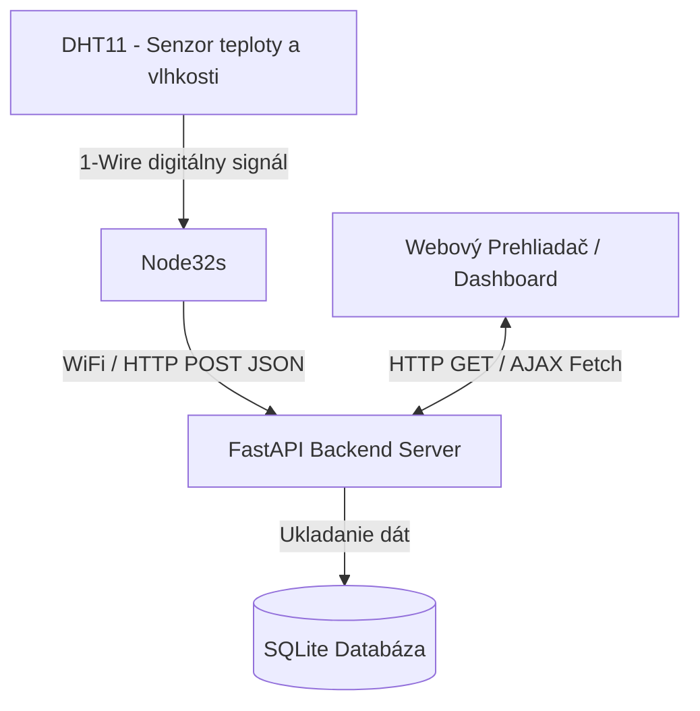
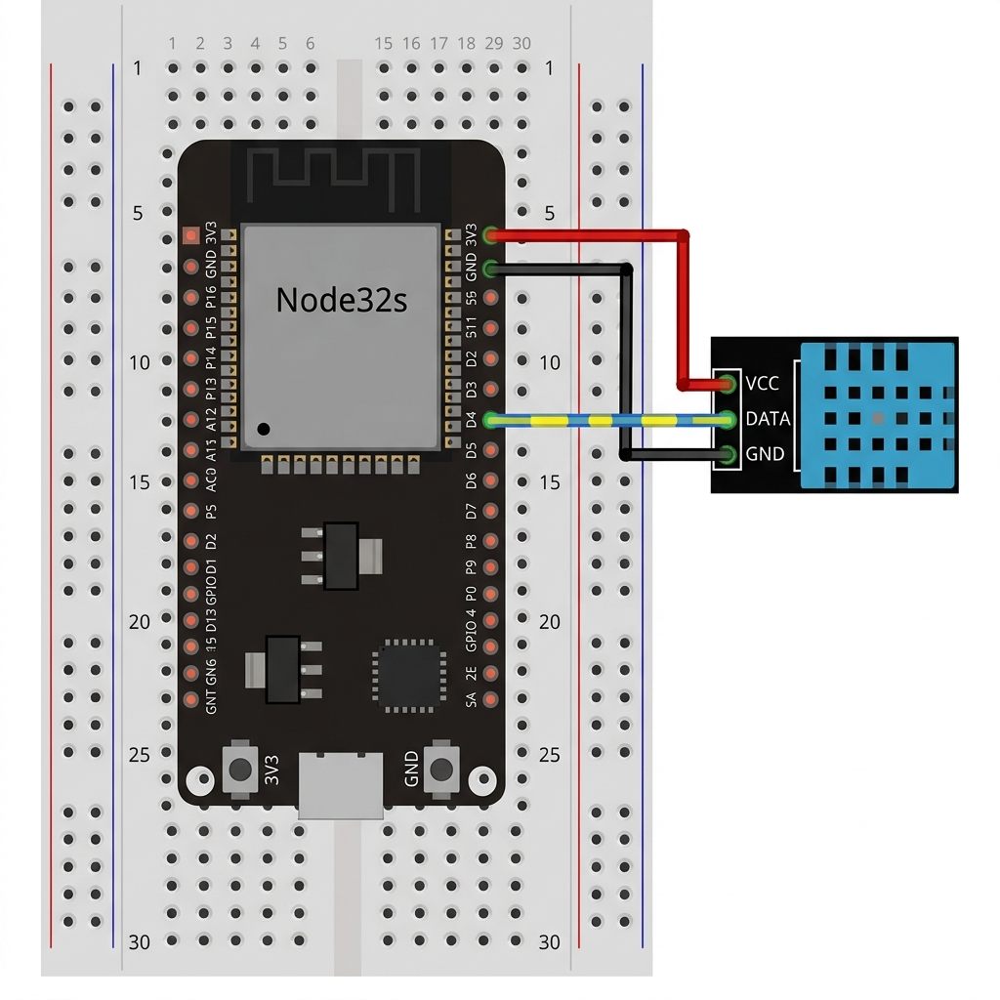
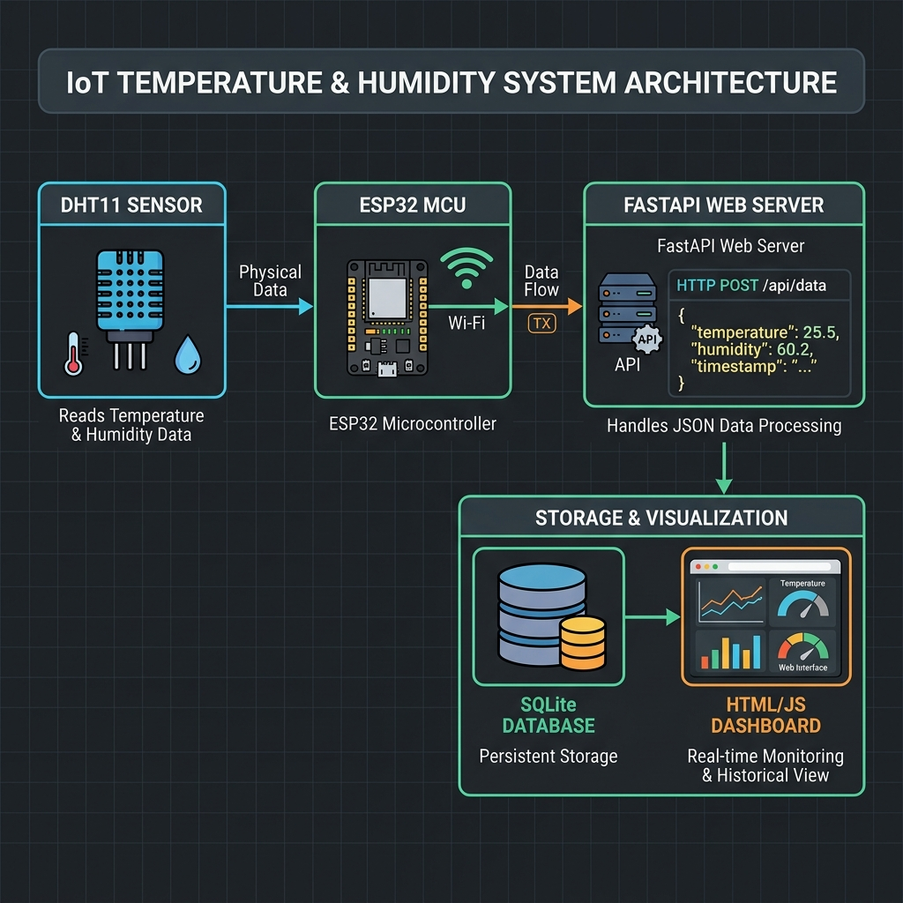

# MISA - Monitorovanie Prostredia (Teplota a Vlhkosť)

## Účel Projektu a Merané Veličiny
Tento projekt predstavuje ucelený systém pre vzdialené monitorovanie fyzikálnych veličín - konkrétne **teploty** a **vlhkosti**. Cieľom je kontinuálny zber týchto dát pomocou hardvérového snímača, ich bezdrôtový prenos na server a okamžitá vizualizácia pomocou moderného webového dashboardu. Systém slúži ako demonštrácia kompletného IoT (Internet of Things) reťazca od zabudovaného zariadenia až po prezentačnú webovú vrstvu.

## Architektúra Systému

Tento projekt využíva 3-vrstvovú architektúru (Senzor/Mikrokontrolér → Backend Server → Používateľský Dashboard):



Grafické zobrazenie architektúry a fyzického zapojenia nájdete v priečinku `docs/`.

---

## Štruktúra Projektu

Projekt je rozdelený na tri logické celky: firmvér, server a dokumentáciu.

```text
MISA/
├── docs/                   # Obrázky, schémy zapojenia a diagramy
├── firmware/
│   └── main/
│       └── main.ino        # C++ kód pre Node32s (ESP32) a DHT11
├── server/
│   ├── static/             # Statické súbory pre webový dashboard
│   │   ├── css/
│   │   │   └── style.css   # Moderný CSS štýl s podporou responzivity a tmavého režimu
│   │   └── js/
│   │       └── main.js     # Logika dashboardu: Chart.js, animované ciferníky a periodické dopyty
│   ├── templates/
│   │   └── index.html      # HTML šablóna pre hlavnú stránku dashboardu
│   ├── app.py              # FastAPI server (Python backend a REST API)
│   ├── database.db         # Lokálna SQLite databáza pre ukladanie meraní (generuje sa sama)
│   ├── models.py           # ORM definícia tabuliek (SQLAlchemy modely)
│   └── simulate.py         # Testovací simulátor odosielania dát na server
└── README.md               # Táto dokumentácia
```

---

## Použité Knižnice a Technológie

### 1. Hardvér a Mikrokontrolér (firmware)
* **Arduino WiFi.h & HTTPClient.h** – pre sieťovú komunikáciu a odosielanie JSON dát cez HTTP POST.
* **Adafruit DHT Sensor Library** – na čítanie hodnôt teploty a vlhkosti zo senzora DHT11.
* **Adafruit Unified Sensor** – podporná knižnica pre správne fungovanie DHT senzorov.

### 2. Backend a Databáza (server)
* **FastAPI** – moderný, rýchly webový framework pre Python.
* **Uvicorn** – rýchly ASGI webový server pre beh FastAPI aplikácie.
* **SQLAlchemy** – moderné Python ORM na komunikáciu s SQLite databázou bez písania SQL dopytov.
* **Pydantic** – pre dátovú validáciu prichádzajúcich HTTP JSON dát z Node32s.
* **Jinja2** – šablónovací systém pre renderovanie HTML dashboardu.

### 3. Frontend a Vizualizácia (dashboard)
* **Chart.js (v4.4.0)** – interaktívny JavaScript graf zobrazujúci historický vývoj teplôt a vlhkosti na dvoch nezávislých Y osiach.
* **Google Fonts (Outfit)** – moderná a elegantná bezpätková typografia.
* **Custom SVG Gauges** – animované ciferníky na hlavnej obrazovke navrhnuté pomocou čistého SVG a CSS transformácií pre maximálnu ostrosť na všetkých displejoch.

---

## Použitý Hardvér
1. **Mikrokontrolér:** Node32s (chip ESP32-D0WD-V3)
2. **Snímač:** DHT11 (Kategória A - Digitálny snímač teploty a vlhkosti, 3-pinový modul)
3. **Príslušenstvo:** Prepojovacie vodiče (F-to-F), Micro-USB kábel pre napájanie a programovanie.

### Schéma Zapojenia



### Architektúra Systému



## Odôvodnenie Návrhových Rozhodnutí

- **Mikrokontrolérová platforma (Node32s / ESP32):** Zvolená bola platforma ESP32 (konkrétne doska Node32s) pre jej natívnu podporu 2.4GHz WiFi sieté, čo napĺňa primárnu požiadavku R2 (bezdrôtový prenos). Na rozdiel od základných dosiek rodiny Arduino (Uno/Nano) nevyžaduje prídavné moduly pre sieťovú konektivitu a má dostatok výpočtového výkonu.
- **Snímač (DHT11):** Digitálny snímač teploty a vlhkosti. Komunikuje vlastným jednovodičovým digitálnym protokolom (spĺňa Kategóriu A) a vyžaduje iba jeden dátový pin (GPIO 4) na mikrokontroléri. 3-pinový modul má integrovaný pull-up rezistor, čo zjednodušuje zapojenie.
- **Komunikačný protokol (HTTP REST):** Keďže systém odosiela dáta jednosmerne a periodicky z mikrokontroléra na server, použitie klasického HTTP POST dopytu s JSON obsahom je najjednoduchšie, najstabilnejšie a bez nutnosti spravovať dodatočný MQTT broker či riešiť problémy s udržiavaním otvorených WebSocket spojení.
- **Vizualizačná technológia (FastAPI + HTML/JS Dashboard):** Python framework FastAPI poskytuje extrémnu rýchlosť pri tvorbe REST API. Na strane klienta je použitý čistý HTML/JS s knižnicami Chart.js (pre vykreslenie historického grafu) a canvas-gauges (pre aktuálny stav), čo zaručuje plynulý chod aplikácie bez inštalácie masívnych frontendových frameworkov ako React/Angular. Dáta sa aktualizujú pravidelne pomocou `fetch()`.

## Formát Prenášaných Dát
Mikrokontrolér odosiela dáta vo formáte štandardného JSON objektu pomocou POST požiadavky na endpoint `/api/measurements`. Časová pečiatka (`timestamp`) sa z dôvodu presnosti a nezávislosti na RTC module v ESP32 generuje až priamo na strane servera pri uložení do databázy.

**Príklad payloadu z ESP32:**
```json
{
  "temp": 24.5,
  "hum": 48.2
}
```

## Inštalačný Návod a Spustenie

### 1. Spustenie Backend Servera
Backend beží na FastAPI a ukladá dáta do SQLite databázy.

**Prerekvizity:** Nainštalovaný Python 3.9+ na hostiteľskom stroji.

**Postup:**
1. Otvorte terminál v priečinku `server`.
2. Nainštalujte potrebné knižnice:
   ```bash
   pip install fastapi uvicorn sqlalchemy pydantic jinja2 requests
   ```
3. Spustite FastAPI server:
   ```bash
   python app.py
   ```
   *Poznámka: Ak príkaz `python` na Windows nefunguje, použite `py app.py`.*
4. Webový dashboard bude dostupný na adrese `http://127.0.0.1:5001` (alebo z lokálnej sieti na `http://<IP-ADRESA-SERVERA>:5001`).

### 2. Spustenie Simulátora Dát (Pre testovanie bez reálneho ESP32)
Ak nemáte pripojené fyzické ESP32, môžete spustiť priložený simulátor, ktorý generuje realistické zmeny teploty a vlhkosti a posiela ich na lokálny server každých 5 sekúnd:
1. Ponechajte server bežať na porte 5001.
2. Otvorte nový terminál v priečinku `server`.
3. Spustite simulátor:
   ```bash
   python simulate.py
   ```

---

## Ako sprístupniť Dashboard Verejne

Aby bol dashboard a API prístupné komukoľvek z internetu (alebo aby ESP32 mohlo posielať dáta na lokálny počítač mimo domácej siete), môžete použiť:

### Cloudflare Tunnel
1. Stiahnite si nástroj `cloudflared`.
2. Spustite tunel nasmerovaný na váš lokálny port 5001:
   ```bash
   cloudflared tunnel --url http://127.0.0.1:5001
   ```
3. Z terminálu skopírujte vygenerovanú HTTPS adresu (napr. `https://random-subdomain.trycloudflare.com`).
4. Túto adresu nastavte v ESP32 firmware (`main.ino`) ako `serverUrl` (s koncovkou `/api/measurements`).

---

## Správa Databázy (Reset a premazanie dát)

Ak chcete začať s čistým štítom, premazať všetky staré merania a resetovať grafy, môžete to urobiť veľmi jednoducho jedným z týchto dvoch spôsobov:

### Rýchly reset cez príkazový riadok
Pokiaľ máte spustený alebo vypnutý server, môžete spustiť tento príkaz v priečinku `server` na okamžité vymazanie všetkých záznamov:
```bash
python -c "import sqlite3; conn = sqlite3.connect('database.db'); conn.cursor().execute('DELETE FROM readings'); conn.commit()"
```
*(Zmazanie prebehne okamžite, databázový súbor a jeho štruktúra ostanú zachované).*

### Fyzické vymazanie databázového súboru
1. Vypnite spustený server (`Ctrl + C` v termináli).
2. Vymažte súbor `database.db` nachádzajúci sa v priečinku `server/`.
3. Znova spustite server príkazom `python app.py`. Pri štarte server automaticky vytvorí úplne nový, prázdny databázový súbor `database.db` s korektnou štruktúrou.

---

## Návod na Nahratie Firmvéru (Node32s)

1. Stiahnite a nainštalujte si [Arduino IDE](https://www.arduino.cc/en/software).
2. Pridajte podporu pre ESP32 do správcu dosiek (Board Manager) vložením URL adresy od Espressif.
3. Otvorte súbor `firmware/main/main.ino`.
4. V správcovi knižníc (Library Manager) si nainštalujte nasledujúce knižnice:
   - `DHT sensor library` (od Adafruit)
   - `Adafruit Unified Sensor`
5. V zdrojovom kóde vymeňte konštanty `ssid` a `password` za údaje k vašej WiFi sieti.
6. Premennú `serverUrl` zmeňte na verejnú adresu (napr. z Cloudflare/Ngrok) alebo lokálnu IP adresu vášho PC (napr. `http://192.168.1.50:5001/api/measurements`).
7. Pripojte ESP32 cez USB, vyberte správny COM port a zvoľte dosku **"Node32s"**.
8. Kliknite na tlačidlo **Upload**.
