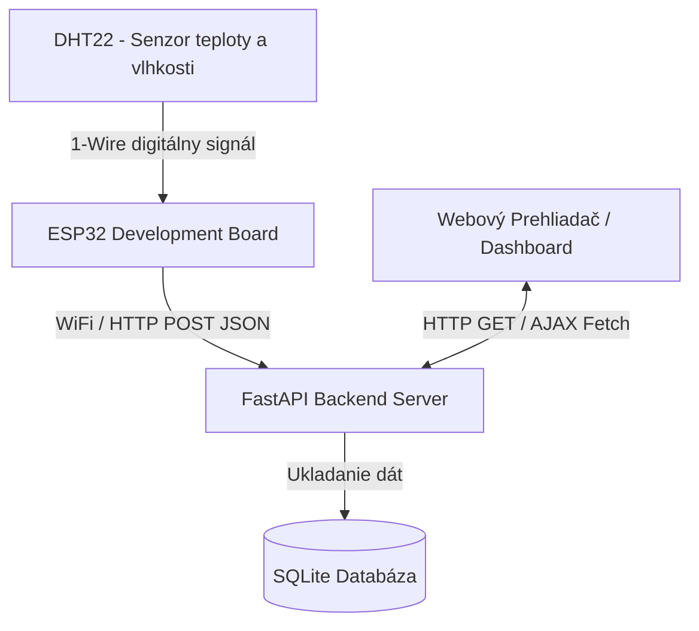

# MISA - Monitorovanie Prostredia (Teplota a Vlhkosť)

## Účel Projektu a Merané Veličiny
Tento projekt predstavuje ucelený systém pre vzdialené monitorovanie fyzikálnych veličín - konkrétne **teploty** a **vlhkosti**. Cieľom je kontinuálny zber týchto dát pomocou hardvérového snímača, ich bezdrôtový prenos na server a okamžitá vizualizácia pomocou moderného webového dashboardu. Systém slúži ako demonštrácia kompletného IoT (Internet of Things) reťazca od zabudovaného zariadenia až po prezentačnú webovú vrstvu.

## Architektúra Systému



## Použitý Hardvér
1. **Mikrokontrolér:** ESP32 (napr. NodeMCU-32S alebo WROOM-32)
2. **Snímač:** DHT22 (Kategória A - Digitálny snímač)
3. **Príslušenstvo:** Prepojovacie vodiče, Breadboard, Micro-USB kábel pre napájanie a programovanie.

## Odôvodnenie Návrhových Rozhodnutí

- **Mikrokontrolérová platforma (ESP32):** Zvolená bola platforma ESP32 pre jej natívnu podporu 2.4GHz WiFi sietí, čo napĺňa primárnu požiadavku R2 (bezdrôtový prenos). Na rozdiel od základných dosiek rodiny Arduino (Uno/Nano) nevyžaduje prídavné moduly pre sieťovú konektivitu a má dostatok výpočtového výkonu.
- **Snímač (DHT22):** Digitálny snímač teploty a vlhkosti. Oproti verzii DHT11 poskytuje vyššiu presnosť a väčší rozsah merania. Komunikuje vlastným digitálnym protokolom (spĺňa Kategóriu A) a vyžaduje iba jeden dátový pin na mikrokontroléri.
- **Komunikačný protokol (HTTP REST):** Keďže systém odosiela dáta jednosmerne a periodicky z mikrokontroléra na server, použitie klasického HTTP POST dopytu s JSON obsahom je najjednoduchšie, najstabilnejšie a bez nutnosti spravovať dodatočný MQTT broker či riešiť problémy s udržiavaním otvorených WebSocket spojení.
- **Vizualizačná technológia (FastAPI + HTML/JS Dashboard):** Python framework FastAPI poskytuje extrémnu rýchlosť pri tvorbe REST API. Na strane klienta je použitý čistý HTML/JS s knižnicami Chart.js (pre vykreslenie historického grafu) a canvas-gauges (pre aktuálny stav), čo zaručuje plynulý chod aplikácie bez inštalácie masívnych frontendových frameworkov ako React/Angular. Dáta sa aktualizujú pravidelne pomocou `fetch()`.

## Formát Prenášaných Dát
Mikrokontrolér odosiela dáta vo formáte štandardného JSON objektu pomocou POST požiadavky na endpoint `/api/measurements`. Časová pečiatka (`timestamp`) sa z dôvodu presnosti a nezávislosti na RTC module v ESP32 generuje až priamo na strane servera pri uložení do databázy.

**Príklad payloadu z ESP32:**
```json
{
  "temp": 24.5,
  "hum": 48.2
}
```

## Inštalačný Návod (Spustenie servera)

### Prerekvizity
- Nainštalovaný Python 3.9+
- Prístup na lokálny port 5001

### Postup
1. Otvorte terminál v priečinku `server`.
2. Vytvorte virtuálne prostredie (voliteľné) a nainštalujte závislosti:
   ```bash
   pip install fastapi uvicorn sqlalchemy pydantic jinja2
   ```
3. Inicializujte databázu a spustite backend:
   ```bash
   python -c "from models import Base, engine; Base.metadata.create_all(bind=engine)"
   python app.py
   ```
4. Server pobeží na `http://0.0.0.0:5001`.

## Návod na Nahratie Firmvéru (ESP32)

1. Stiahnite a nainštalujte si [Arduino IDE](https://www.arduino.cc/en/software).
2. Pridajte podporu pre ESP32 do správcu dosiek (Board Manager) vložením URL adresy od Espressif.
3. Otvorte súbor `firmware/main.ino`.
4. V správcovi knižníc (Library Manager) si nainštalujte nasledujúce knižnice:
   - `DHT sensor library` (od Adafruit)
   - `Adafruit Unified Sensor`
5. V zdrojovom kóde vymeňte konštanty `ssid` a `password` za údaje k vašej WiFi sieti.
6. Premennú `serverUrl` zmeňte na IP adresu a port stroja, kde vám beží lokálny backend (napr. `http://192.168.1.50:5001/api/measurements`).
7. Pripojte ESP32 cez USB, vyberte správny COM port a zvoľte dosku "DOIT ESP32 DEVKIT V1".
8. Kliknite na tlačidlo **Upload**.

## Prístup k Webovému Rozhraniu (Dostupnosť / R5)
Zariadenie a vizualizácia sú primárne dostupné na lokálnej sieti adrese `http://<IP-ADRESA-SERVERA>:5001`. 
Pre verejnú dostupnosť odkiaľkoľvek z internetu môžete spustiť Cloudflare Tunnel nasmerovaný na tento port:
```bash
cloudflared tunnel --url http://127.0.0.1:5001
```
Následne získate vygenerovanú bezpečnú HTTPS adresu (napr. `https://misa-projekt.trycloudflare.com`), na ktorej bude Dashboard dostupný. Nezabudnite si pre túto adresu aktualizovať `serverUrl` premennú v kóde ESP32!
